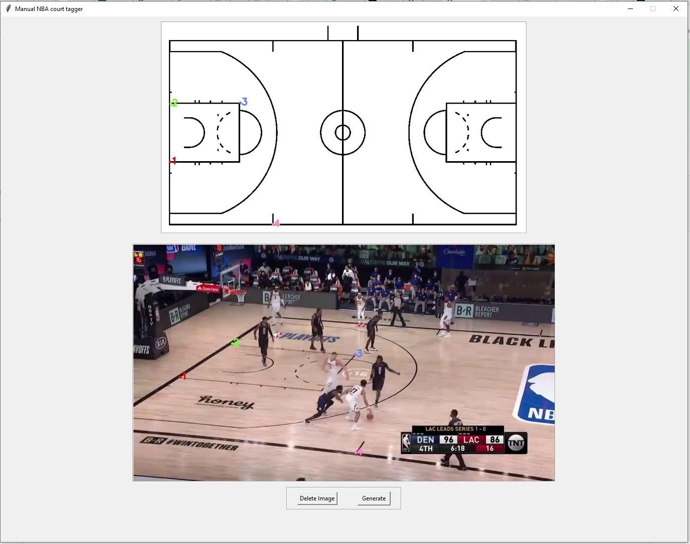

# BasketballCourtTagger
Efficient and easy GUI to tag and find homography transformations between courts from a basketball game to a 2d basketball court

In case you want to tag different (sports) courts, replace you can easily replace the given court images with yours.




## Requirements

```bash
pip install pickle-mixin
pip install tkintertable
```

## Running
```bash
python ManualCourtEdgesTaggerGUI.py --games_images_path YOUR_PATH
```

Where YOUR_PATH is the directory where all the game frames are located.

Make sure you have all 3 images: nba_court_gray_bitmap.bmp, nba_court_phase1_bitmap.bmp and nba_court_white.jpg in YOUR_PATH where all the 
